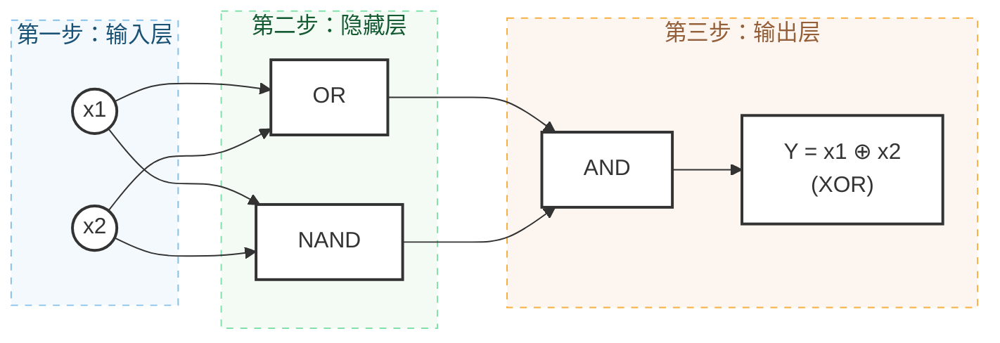
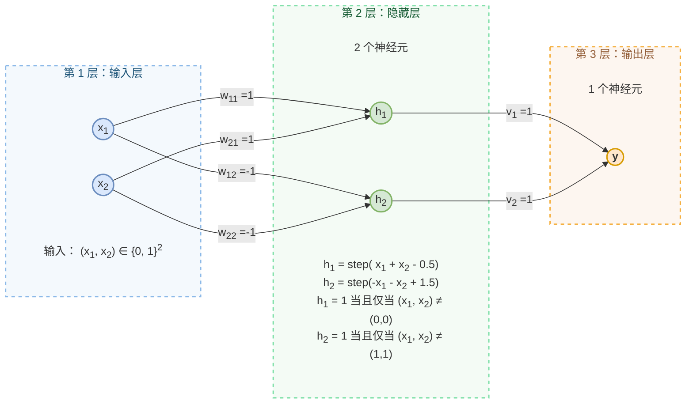

# 本节内容
1. 课程引入与问题背景
2. 电路启发：组合解决异或
3. 多层感知机原理与结构
4. 非线性激活的必要性
5. 训练难题与反向传播

# 电路启发

## 逻辑电路异或门
> [!TIP]  
> **由简单模块组合复杂功能**

XOR 问题早在逻辑电路得到解决，计算机的异或门是由更基础的门电路组合而成的

- $\text{OR} \to x_1 \ \text{OR} \ x_2$ : 至少一个输入为 1
- $\text{NAND not and} \to \text{NOT}(x_1 \ \text{AND} \ x_2)$ : 两个输入不同时为 1

## 两层感知机解决XOR

> [!TIP]  
> 两层感知机通过组合简单的线性分隔（OR 和 NAND），在最后一层实现异或（XOR）

- 输入层  
	接收两个特征 $x_1 \ , \ x_2$
- 隐藏藏  
	两个神经元使用不同的权重并行运算，各自画一条分割线，输出 0 或 1
- 输出层  
	将隐藏层的两个输出作为输入，再一次加权求和后激活，得到异或判断

| $x_1$ | $x_2$ | y(XOR) |
|:-----:|:-----:|:------:|
|0|0|0|
|0|1|1|
|1|0|1|
|1|1|0|

第一个隐藏层学会 **至少一个输出为 1**  
第二个隐藏层学会 **输出不能同时为 1**  
输出层对两个条件取交集  

# 多层感知机的原理与结构

## 多层结构的思想来源
1. 神经科学  
	大脑皮层是分层处理的  
	底层神经元响应边缘和方向，高层神经元响应人脸和物体  
2. 函数逼近理论  
	任何函数都可以用简单函数的组合来逼近  
	泰勒展开、傅里叶变换等  

## 多层感知机的一般结构
多个感知机按层排列，层间全连接，构成了 **多层感知机 (MLP)**
- 输入层接收原始特征，数个隐藏层进行中间预算，输出层给出最终结果
- 同一层的神经元 **并行提取多个不同的特征或规则**
- 后续层将前一层的输出作为输入，利用不同权重进一步组合，**逐层构造更加抽象、更加有效的表达**

数学表达：**函数的层层嵌套**
$$output = h_n(h_{n-1}(\ldots(h_2(h_1(X)))))$$

# 非线性激活的必要性

## 为何多层线性变换无效
假设  
第一层输出为 $h = W_1 x + b_1$   
第二层输出为 $y = W_2 h + b_2$   
即 $y = W_2(W_1x+b_1)+b_2 = (W_2 W_1)x + (W_2b_1 + b_2)$   
令 $W' = W_2W_1, \ b' = W_2b_1 +b_2$  
则 $y = W'x + b'$ , 仍为线性形式

> [!TIP]  
> 线性变换的组合仍是线性变换  
> 即便层层叠加也是徒劳  

## 使用激活函数打破线性
在每个神经元的加权求和输出上加一个非线性函数，称为 **激活函数 (Activation Function)**  
$$ h = f(Wx + b)$$

引入非线性的 $f$ , 层间组合无法被化简为单一线性变换  

**阶跃函数 (Step Function)**

$$
step(z) = 
\begin{cases}
	1 \ 若 \quad z \ge 0\\
	0 \ 若 \quad z < 0\\
\end{cases}
$$

## 万能逼近定理
1989 年正式证明了 **万能逼近定理 (Universal Approximation Theorem)**

> [!Note]万能逼近定理  
> 一个含有充足神经元的单隐藏层 MLP, 可以任意精度逼近任意连续函数

- 意味 MLP 在理论上具备表达任何函数的能力  
- **表达能力** (足够多神经元) 和 **训练能力** (如何找到正确权重) 是两个不同问题  

深度学习而非宽度学习  
后续训练发现增加隐藏层的层数，比增加层内的神经元数量，能取得更佳的效果  

# 训练难题与反向传播

## 模型训练仍是难题
多层网络能力如此强大，为何深度学习还会经历二十多年寒冬？  
- MLP 结构早在 1960 年代提出，虽然有人想到多层网络，但是 **没法训练**  
- 当时的感知机学习规则 **只适用于单层网络**  
- **核心难题是如何分配隐藏层误差**  
	1. 如何分配层间误差，确定哪个隐藏层的误差
	2. 如何分配层内误差，确定哪个神经元权重的误差

1986 年，**反向传播算法 (Back propagation)** 与多层网络结合，形成高效计算多层梯度方法  

