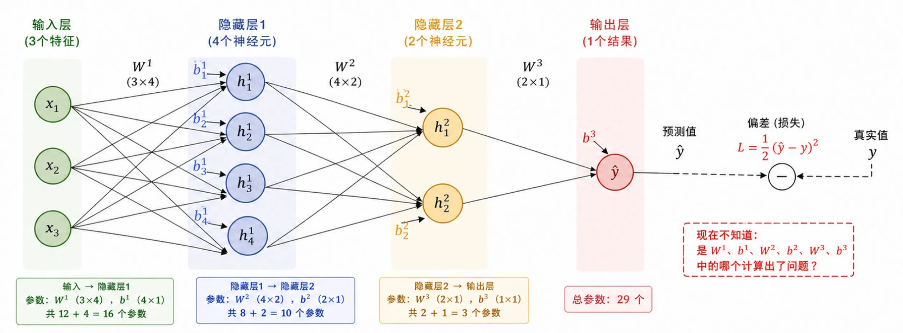
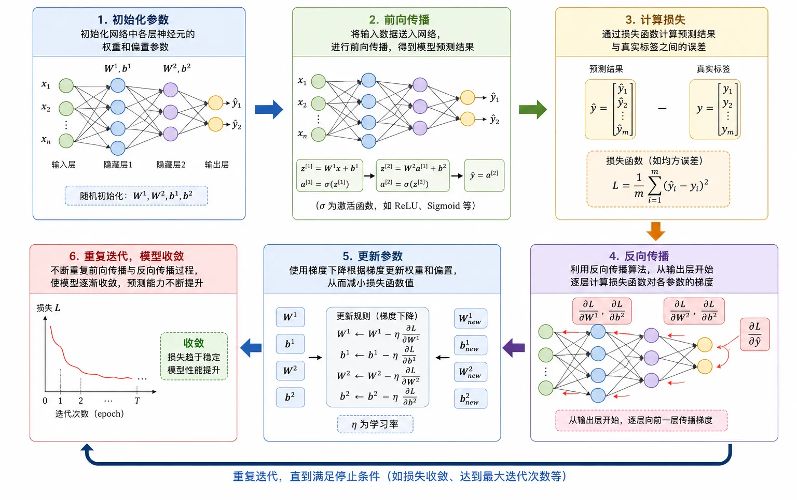
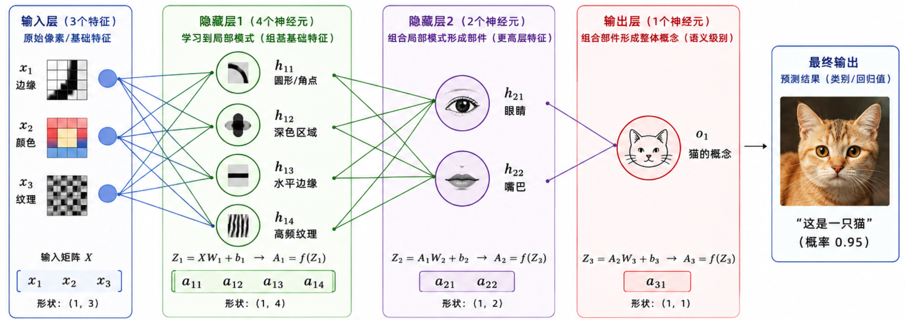
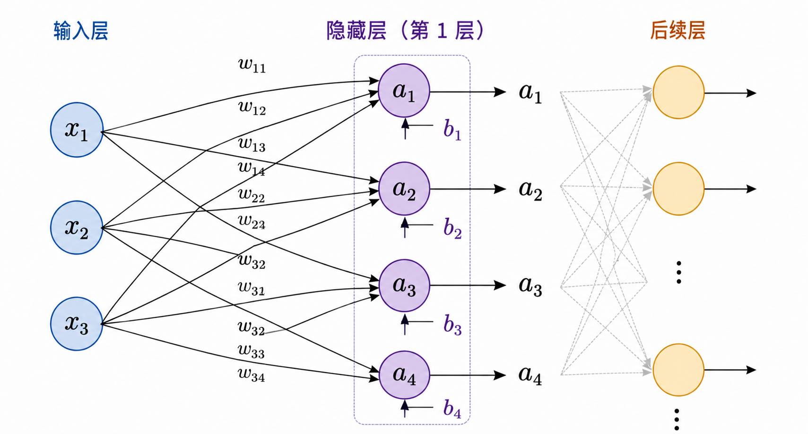
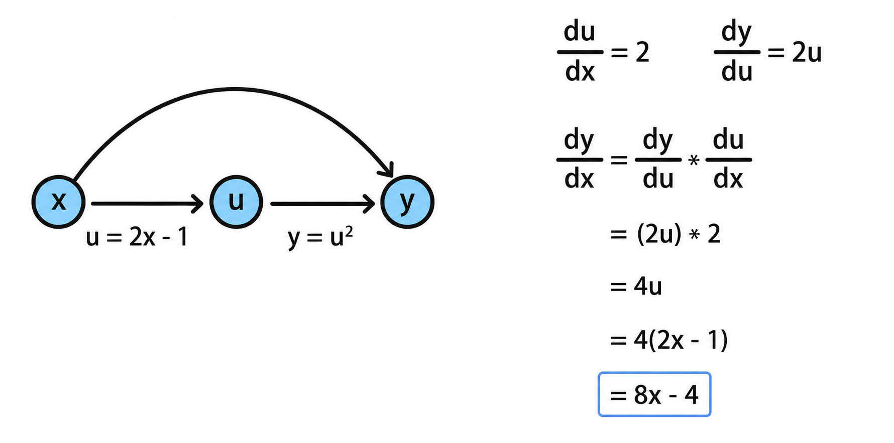
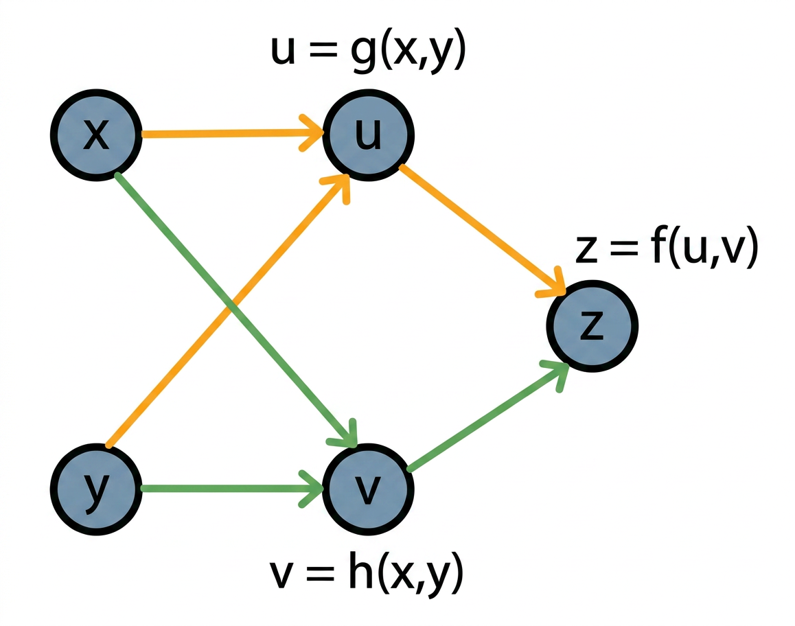
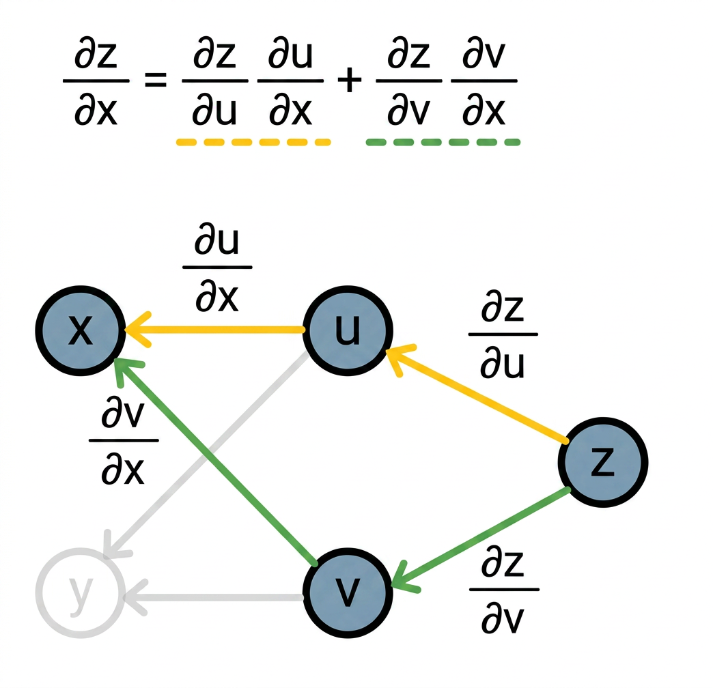
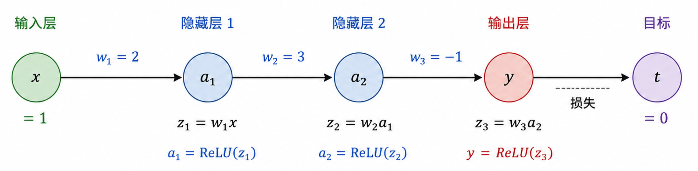
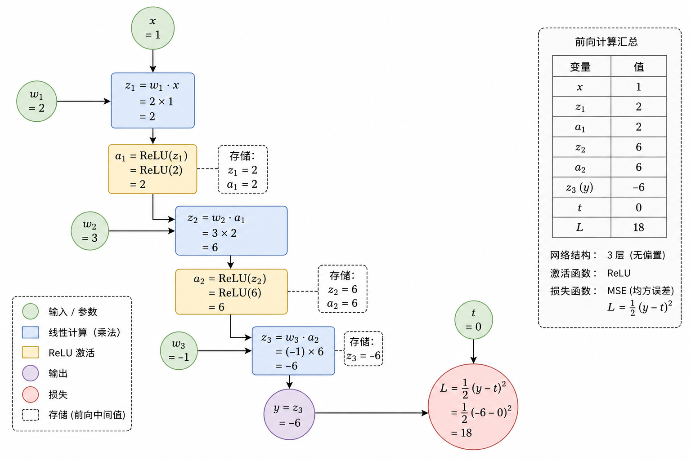
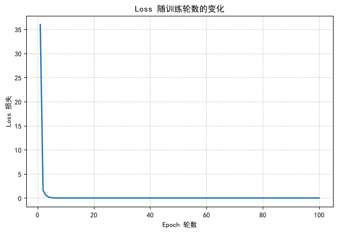

# 本节内容
1. 反向传播的重要性
2. 神经网络训练难题
3. 层追责的类比
4. 训练流程总览
5. 前向传播原理
6. 神经元计算与矩阵
7. 链式法则核心
8. 手动反向传播推演
9. Pytorch 代码实现

# 反向传播的重要性
反向传播在神经网络中占据中流砥柱地位，诠释神经网络如何学习

## 神经网络训练难题
神经网络只要 **神经元和层数充足**，理论上可以拟合任意函数  



海量参数带来强大能力，同时产生棘手问题：  
*当预测错误时，如何调整海量参数*  

## 反向传播的诞生
反向传播算法解决多层网络的训练难题
- 困境  
	网络层数越深参数越多，无法对每一个参数**手动求导**  
- 突破  
	1986年, Hinto, Rumelhart, Williams 提出**反向传播算法**
- 核心思想  
	利用**链式法则**，误差从输出层逐层传回，一次性算出所有梯度

# 反向传播的本质

## 层层追责的类比
借公司处理新品上市伴随市场批评的追责流程，类比解释反向传播本质  


- 输出结果: 产品上市
- Loss 巨大: 市场差评

追责三大层级
1. CEO 追责部门经理  
	CEO 根据分析将结果主要归咎于软件 BUG, 其次是营销失败  
	轻重有别地责罚技术总监和营销总监  
2. 部门经理追责组长  
	技术总监排查发现 BUG 来自前端，与无端基本无关  
	主要责罚前端组长  
3. 组长追责组员  
	前端组长排查错误来源，对失误的组员追责，无关其他组员

> [!TIP]  
> **从最终结果出发，逐层倒推分配责任的机制**  
> 对误差的影响越大，参数的调整就越大

# 训练流程总览



1. 初始化参数  
	初始化各层神经元的权重和偏置参数  
2. 前向传播  
	输入数据做前向传播，得到预测结果  
3. 计算损失  
	用损失函数计算预测与真实标签的误差  
4. 反向传播  
	用反向传播从输出层逐层计算损失函数对参数的梯度  
5. 梯度调参  
	用梯度下降更新权重和偏置减小损失值  
6. 迭代收敛  
	不断重复前反向传播，直到模型逐步收敛  

称每次循环为 **迭代 (iteration)**  
称每轮所有数据完成训练为 **epoch**  

# 前向传播原理
前向传播可谓模型用参数做预测的过程  
数据沿网络从输入流向输出  
线性加权 → 加偏置 → 激活函数  
将信息重构为高阶特征传递至下一层  



> [!TIP]  
> 通过 **逐层抽象** 机制让神经网络具备自动学习特征的能力  

## 神经元计算与矩阵
每个神经元进行的同套操作  
1. 线性变换上层输入  
	$z = w_1x_1 + w_2x_2 + \ldots + w_nx_n + b$   
2. 非线性激活新特征  
	$a = \sigma (z)$

差别是每个神经元维护自有的一套权重和偏置  



$$
\begin{array}{c}
	a_1 = \sigma (w_{11}x_1 + w_{12}x_2 + w_{13}+x_3 + b_1)\\
	a_2 = \sigma (w_{21}x_1 + w_{22}x_2 + w_{23}+x_3 + b_2)\\
	a_3 = \sigma (w_{31}x_1 + w_{32}x_2 + w_{33}+x_3 + b_3)\\
	a_4 = \sigma (w_{41}x_1 + w_{42}x_2 + w_{43}+x_3 + b_4)\\
\end{array}
$$

得到通项形式，第 $l$ 层第 $i$ 个神经元的输出  

$$
a_i^{(l)} = \sigma (\sum \limits _{j=1}^n w_{ij}^{(l)} a_j^{(l-1)} + b_i^{(l)})
$$

简写为向量内积有  

$$
a_i^{(l)} = \sigma ((w_i^{(l)})^Ta^{(l-1)}+b_i^{(l)})
$$

通过一次矩阵乘法完成整层神经元的输出计算

$$
A^{(l)} = \sigma (W^{(l)}A^{(l-1)} + b^{(l)})
$$

以图例中演示一次性的计算，输出层共有 3 个特征，首个隐藏层共有 4 个神经元

$$
A^{(l)} = \sigma (W^{(l)} A^{(0)} + b^{(1)}) = \sigma (
\begin{bmatrix}
	w_{11} w_{21} w_{31}  \\
	w_{12} w_{22} w_{32}  \\
	w_{13} w_{23} w_{33}  \\
	w_{14} w_{24} w_{34}  \\
\end{bmatrix}\,
\begin{bmatrix}
	a^{(0)}_1 \\
	a^{(0)}_2 \\
	a^{(0)}_3 \\
\end{bmatrix} +
\begin{bmatrix}
	b^{(l)}_1 \\
	b^{(l)}_2 \\
	b^{(l)}_3 \\
	b^{(l)}_4 \\
\end{bmatrix})
$$

> [!TIP]  
> 由于计算过程是一系列大型矩阵乘法，因此 **GPU 天然适用**神经网络计算  

# 反向传播推演

## 损失函数和梯度下降
先前传播得到预测结果 $\hat{y}$   
但和真实标签 $y$ 会有差距  
通过损失函数量化这一差距  

**线性回归常用 MSE ：**

$$
\mathcal{L} = \cfrac{1}{N} \sum \limits _{i=1}^N (y_i - \hat{y_i})^2
$$

**误差** $\mathcal{L}$ **越大，偏离越严重**  
为最小化误差 $\mathcal{L}$ ，如何调整权重矩阵 $W$ 和偏置 $b$   
在线性回归及逻辑回归的过程中采用 **梯度下降**：  
1. 计算损失函数对每个参数的偏导组成向量，即得梯度  
2. 梯度指向损失上升最快的方向，沿负梯度小幅调参即可缩小损失  

$$
W \gets W - \eta \cdot \cfrac{\partial \mathcal{L}}{\partial W}
$$

## 链式法则与计算图
如果 $x$ 影响 $u$ , $u$ 又影响 $y$ ，那么 $x$ 对 $y$ 的**总影响为两端影响的乘积**  

$$
\begin{array}{c}
	若 \, y=f(u), \, u = g(x), \\
	则 \quad \cfrac{dy}{dx} = \cfrac{dy}{du} \cdot \cfrac{du}{dx}
\end{array}
$$

### 单变量计算图
以 $y = u^2, \, u = 2x - 1$ 为例



$$
\begin{array}{c}
	代入 \, x = 1, \, \cfrac{dy}{dx} = 4, \ 即 \ x \ 每增加 \ 0.001, \ y \ 大约增加 \ 0.004
\end{array}
$$

### 多变量计算图
若函数输入多个变量，则链式法则变成**对所有路径导数求和**  

设 $z = f(u,v), \, u= g(x,y), \, v = h(x,y)$   
则 $x$ 沿二路影响 $z$  
- $x \to u \to z$  
- $x \to v \to z$  

每路以单变量链式法则计算导数，之后求和





以 $z = u^2 + v^2, \ u = z + y, \ v = x - y$ 为例  

$$
\cfrac{\partial z}{\partial x} = 2u \cdot 1 + 2v \cdot 1 = 2(x+y) + 2(x-y) = 4x
$$

## 计算图与局部梯度
- 前向传播  
	顺沿箭头方向, 计算每个节点的值  
- 反向传播  
	逆沿箭头方向, 以链式法则将局部梯度累乘，直到回输入端  

> [!TIP]
> **计算图的妙处**  
> 将多元复合求导简化为 "沿路径对局部梯度相乘"  
> 每个节点仅关注自身的输入输出  
> 这一特性构成 Pytorch 等框架进行**自动微分**的基础  

## 构造极简神经网络



- 网络结构  
	每层 1 个神经元，不设偏置，共计 3 层  
	输入 $x = 1$ 目标 $t = 1$   
	初始权重 $w_1 = 2, w_2 = 3, w_3 = -1$  
- 激活函数  
	使用 ReLU 替换阶跃函数便利求导  
	$\text{ReLU}(z) = \begin{cases}
		z, \ \text{if} \ z > 0 \\
		0, \ \text{if} \ z \le 0 
	\end{cases}$
- 损失函数  
	简化的 MSE $L = \cfrac{1}{2}(y-t)^2$

### 前向传播



- $z_1 = w1x = 2 \times 1 = 2$   
- $a_1 = \text{ReLU}(z_1) = \text{ReLU}(2) = 2$   
- $z_2 = w_2a_1 = 3 \times 2 = 6$   
- $a_2 = \text{ReLU}(z_2) = \text{ReLU}(6) = 6$   
- $z_3 = w_3 a_2 = (-1) \times 6 = -6$   
- $y = z_3 = -6$
- $L = \cfrac{1}{2} (y - t)^2 = \cfrac{1}{2} (-6 - 0)^2 = 18$

预测结果 -6 距离目标 0 相差甚远，损失高达 18，后续通过反向传播调参  

### 反向传播
ReLU的导数  

$$
\text{ReLU}'(z) = 
\begin{cases}
	1, \quad z > 0 \\
	0, \quad z \le 0 \\
\end{cases}
$$

- 处处可导，便利反向传播 ( 0 处规定为 1 )  
- 导数极简，提升运算速度


1. 从损失函数出发，计算 $\cfrac{\partial L}{\partial y}$   
	这是反向传播的起点，代表损失对网络输出的敏感度

$$
\begin{array}{c}
	对 \, L = \cfrac{1}{2} (y - t)^2 \, 求 y 的偏导 \\
	\cfrac{\partial L}{\partial y} = y - t = -6 - 0 = -6 \\
\end{array}
$$

2. 穿过输出层，计算 $\cfrac{\partial L}{\partial z_3}$   
	由于本例的输出层没有激活函数, $y = z_3$ , 因此 $\cfrac{\partial y}{\partial z_3} = 1$  

$$
\begin{array}{c}
	\cfrac{\partial L}{\partial z_3} = \cfrac{\partial L}{\partial y} \cdot \cfrac{\partial y}{\partial z_3} = (-6) \cdot 1 = -6
\end{array}
$$

3. 计算 $w_3$ 梯度  
	由于 $z-3 = w_3 \cdot a_2$ , 因此 $\cfrac{\partial z_3}{\partial w_3} = a_2 = 6$   

$$
\begin{array}{c}
	\cfrac{\partial L}{\partial w_3} = \cfrac{\partial L}{\partial z_3} = (-6) \cdot 6 = -36
\end{array}
$$

4. 穿过第 2 层激活函数，计算 $\cfrac{\partial L}{\partial z_2}$   

$$
\begin{array}{c}
	先将梯度从 z_3 传回 a_2,\ 由 z_3 = w_3\cdot a_2 得 \cfrac{\partial z_3}{\partial a_2} = w_3 = -1 \\
	\cfrac{\partial L}{\partial a_2} = \cfrac{\partial L}{\partial z_3} \cdot \cfrac{\partial z_3}{\partial a_2} = (-6) \cdot (-1) = 6 \\
	再穿过 \ \text{ReLU} , 由于前向时 z_2 = 6 > 0, \ 因此 \ \text{ReLU} \ 导数为 1 \\
	\cfrac{\partial L}{\partial z_2} = \cfrac{\partial L}{\partial a_2} \cdot \cfrac{\partial a_2}{\partial z_2} = 6 \cdot 1 = 6 \\
\end{array}
$$

> [!TIP]
> 此处体现 **保留前向中间值的意义**  
> 通过 $z_2 = 6$ 判断 ReLU 的导数为 0 或是 1

5. 计算 $w_2$ 梯度  
	由于 $z_2 = w_2 \cdot a_1$ 因此 $\cfrac{\partial z_2}{\partial w_2} = 2$   

$$
\begin{array}{c}
	\cfrac{\partial L}{\partial w_2} = \cfrac{\partial L}{\partial z_2} \cdot \cfrac{\partial z_2}{\partial w_2} = 6 \cdot 2 = 12
\end{array}
$$

6. 穿过第 1 层激活函数，计算 $\cfrac{\partial L}{\partial z_1}$   

$$
\begin{array}{c}
	由 z_2 = w_2 \cdot a_1 得 \cfrac{\partial z_2}{\partial a_1} = w_3 = 3 \\
	\cfrac{\partial L}{\partial a_1} = \cfrac{\partial L}{\partial z_2} \cdot \cfrac{\partial z_2}{\partial a_1} = 6 \cdot 3 = 18 \\
	再穿过 \text{ReLU} \, (z_1 = 2 > 0, 导数为 1) \\
	\cfrac{\partial L}{\partial z_1} = \cfrac{\partial L}{\partial a_1} \cdot \cfrac{\partial a_1}{\partial z_1} = 18 \cdot 1 = 18
\end{array}
$$

7. 计算 $w_1$ 梯度  

$$
\begin{array}{c}
	由于 z_1 = w_1 \cdot x, 因此 \cfrac{\partial z_1}{\partial w_1} = x = 1\\
	\cfrac{\partial L}{\partial w_1} = \cfrac{\partial L}{\partial z_1} \cdot \cfrac{\partial z_1}{\partial w_1} = 18 \cdot 1 = 18
\end{array}
$$

|参数梯度|梯度值|含义|
|:----:|:----:|:------------:|
| $\cfrac{\partial L}{\partial w_1}$ |18| $w_1$ 增加 1，损失增加约 18|
|$\cfrac{\partial L}{\partial w_2}$|12| $w_2$ 增加 1，损失增加约 12|
|$\cfrac{\partial L}{\partial w_3}$|-36| $w_3$ 增加 1，损失减少约 36|

 $w_3$ 贡献最大

### 梯度下降
前向传播算得误差，反向传播算得梯度  
后续通过梯度下降调整参数，使损失减少  
调参之后再次前向传播，验证误差是否缩小  

梯度下降公式  

$$
w \gets w - \eta \cfrac{\partial L}{\partial w}
$$

设学习率 $\eta = 0.01$ 代入给参数的梯度


|**参数**|**旧值**|**梯度**|**更新量** $-\eta \cdot \nabla$ |**新值**|
|---|---|---|---|---|
| $w_1$ |2|18| $-0.01 \times 18 = -0.18$ |**1.82**|
| $w_2$ |3|12| $-0.01 \times 12 = -0.12$ |**2.88**|
| $w_3$ |-1|-36| $-0.01 \times (-36) = +0.36$ |**-0.64**|

重新前向传播  
- $z_1 = 1.82 \times 1 = 1.82, a_1 = 1.82$   
- $z_2 = 2.88 \times 1.82 \approx 5.2416, a_2 \approx 5.2416$   
- $z_3 = (-0.64) \times 5.2416 \approx -3.3546$   
- $y' \approx -3.3546$   

更新损失  
$L' = \cfrac{1}{2} (-3.3546 - 0)^2 \approx 5.63$  
- 更新前的损失: 18 (预测值 -6)
- 更新后的损失: 约 5.63 (预测值 -3.35)

# PyTorch 代码实现
PyTorch 通过 **自动微分 (Autograd)** 的核心机制处理反向传播的细节  
PyTorch 通过人工提供的前向公式，在后台自动构建计算图  
再结合 `loss.backward()` 一次性计算所有的梯度  

## 代码

```python
import torch
import torch.nn as nn

# 首次导库做下验证
print("PyTorch Version:", torch.__version__)
print("CUDA Available:", torch.cuda.is_available())          # Windows / Linux NVIDIA 期望 True
print("MPS Available:", torch.backends.mps.is_available())   # Mac M 系列期望 True

# 建立张量 
x = torch.tensor([[1.0]])
t = torch.tensor([[0.0]])

# 建立网络 
model = nn.Sequential(
	nn.Linear(1, 1, bias = False), # w1
	nn.ReLU(),
	nn.Linear(1, 1, bias = False), # w2
	nn.ReLU(),
	nn.Linear(1, 1, bias = False), # w3
)

# 初始化权重
with torch.no_grad():
	model[0].weight.fill_(2.0)
	model[2].weight.fill_(3.0)
	model[4].weight.fill_(-1.0)

# 配置损失函数及优化器
# 损失函数 MSE
criterion = nn.MSELoss()
# 优化器 随机梯度下降 SGD
optimizer = torch.optim.SGD(model.parameters(), lr=0.01)

# 损失值的记录容器
loss_history = [] # idea by WangSen679

# 训练 100 轮
for epoch in range(100):
	loss = criterion(model(x), t)	# 前向传播 + 计算损失
	optimizer.zero_grad()					# 清空上一轮余留的梯度
	loss.backward()								# 反向传播自动计算梯度
	optimizer.step()							# 梯度下降更新权重
	loss_history.append(loss.item())
	if epoch % 10 == 0:
		print(f"Epoch {epoch+1:3d} | 预测值: {model(x).item():7.4f} | 损失: {loss.item():.4f}")

# 损失可视化
# 这部分代码基于 WangSen679:backprop-visualization 
# https://github.com/WangSen679/DL_qx2io/tree/backprop-visualization
# 谢谢你的支持
# 更多详情可见 Pull Request #1
# https://github.com/NothingForID/Deep_Learning/pull/1  
import matplotlib.pyplot as plt
plt.rcParams['font.sans-serif'] = ['SimHei']
plt.rcParams['axes.unicode_minus'] = False

plt.figure(figsize = (8, 5))
plt.plot(range(1, len(loss_history) + 1), loss_history, color='tab:blue', linewidth=2)

plt.xlabel('Epoch 轮数')
plt.ylabel('Loss 损失')
plt.title('Loss 随训练轮数的变化')
plt.grid(True, linestyle='--', alpha = 0.6)
plt.show()

```

## 输出

```
Epoch   1 | 预测值: -1.2674 | 损失: 36.0000
Epoch  11 | 预测值: -0.0084 | 损失: 0.0002
Epoch  21 | 预测值: -0.0001 | 损失: 0.0000
Epoch  31 | 预测值: -0.0000 | 损失: 0.0000
Epoch  41 | 预测值: -0.0000 | 损失: 0.0000
Epoch  51 | 预测值: -0.0000 | 损失: 0.0000
Epoch  61 | 预测值: -0.0000 | 损失: 0.0000
Epoch  71 | 预测值: -0.0000 | 损失: 0.0000
Epoch  81 | 预测值: -0.0000 | 损失: 0.0000
Epoch  91 | 预测值: -0.0000 | 损失: 0.0000
```




> [!IMPORTANT]
> 损失曲线可视化的代码基于 [WangSen679:backprop-visualization](https://github.com/WangSen679/DL_qx2io/tree/backprop-visualization) , 感谢你的支持  
> 更多详情可见 [Pull Request #1](https://github.com/NothingForID/Deep_Learning/pull/1)

> [!TIP]
> 由于 PyTorch 的 `nn.MSELoss()` 默认没有系数 $\cfrac{1}{2}$ ，而是 $(y - t)^2$   
> 因此第 1 轮损失为 36 而非推演的 18  
> 梯度也会相应大一倍，但不影响最终收敛结果

